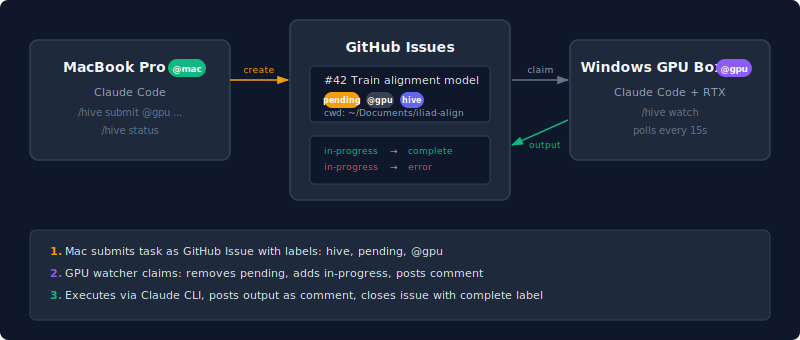

# agent-hive

Run Claude Code tasks on remote machines. Submit from your main workstation, execute on others (e.g. a Windows box with GPU). GitHub Issues is the task queue - labels for routing, comments for output, no infrastructure to set up.

## How it works

Each machine runs a watcher that polls GitHub Issues for pending tasks and
executes them via Claude Code CLI. Labels route tasks to specific machines,
comments capture output. Submit from anywhere, execute anywhere.

<p align="center">
  
</p>

## Requirements

- `gh` CLI (authenticated): `gh auth login`
- Claude Code CLI: `claude`

## Setup

```bash
# On each machine, set the box name
python hive.py box mac     # on your Mac
python hive.py box gpu     # on the GPU box

# Register with the hive (creates the @box label)
python hive.py register

# Start watching for tasks
python hive.py watch --daemon
```

## Commands

| Command | Description |
|---------|-------------|
| `python hive.py submit "Task description" --target gpu` | Submit a task |
| `python hive.py submit "Rebuild" --after 42` | Task depends on #42 |
| `python hive.py status` | Show open tasks |
| `python hive.py status all` | Show all tasks |
| `python hive.py watch` | Start watching (foreground) |
| `python hive.py watch --daemon` | Start watching (background) |
| `python hive.py reset 42` | Reset task #42 to pending |
| `python hive.py box [name]` | Show or set box name |
| `python hive.py register [name]` | Register box with the hive |

## Labels

Tasks are GitHub Issues with these labels:

| Label | Meaning |
|-------|---------|
| `hive` | All hive tasks have this label |
| `pending` | Waiting to be claimed |
| `in-progress` | Being executed by a watcher |
| `complete` | Finished successfully (issue closed) |
| `error` | Execution failed |
| `@gpu`, `@mac` | Route to a specific box |

## Task routing

- `--target gpu` adds the `@gpu` label. Only the GPU watcher picks it up.
- Without `--target`, any watcher can claim it.
- Dependencies: `--after 42` blocks until issue #42 is closed with `complete`.

## As a Claude Code skill

Copy `SKILL.md` to use `/hive` commands in Claude Code conversations.
The skill translates `/hive submit @gpu Train model` into the appropriate
`python hive.py` calls.

## Compared to git task files

The previous version used git-tracked markdown files with optimistic locking
via `git push`. This version uses GitHub Issues instead:

| | Git task files | GitHub Issues |
|---|---|---|
| State transitions | Race-prone (git push) | Atomic (API) |
| UI | Custom web server | GitHub.com / mobile app |
| Notifications | Custom file-based | GitHub email/push |
| Filtering | grep | Labels + search |
| History | git log | Issue timeline |
| Dependencies | Custom parsing | Issue references |

## License

MIT
